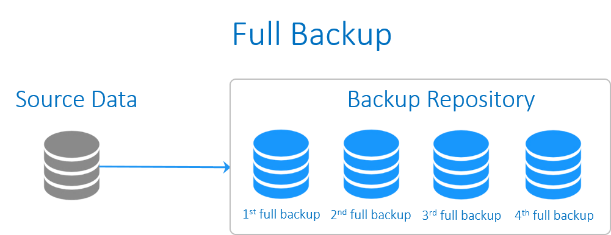
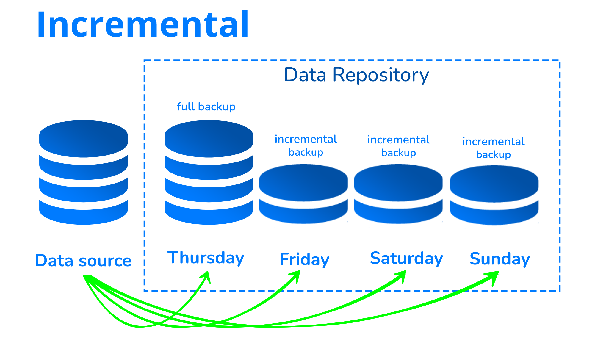
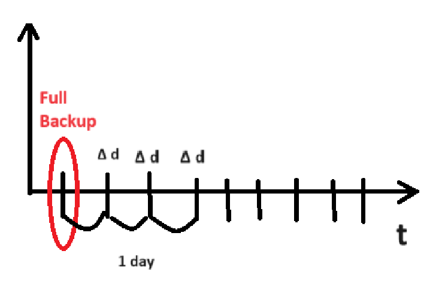
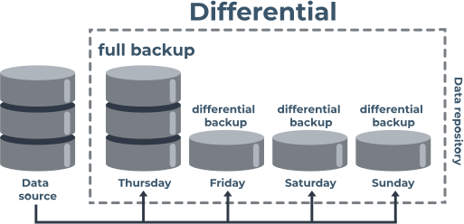
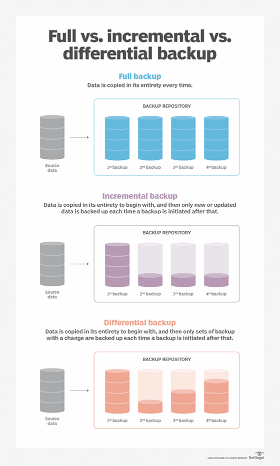
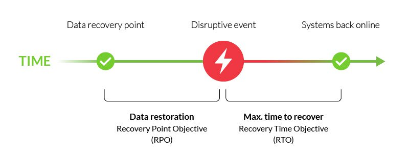

# Backup

### Какво е Backup?

В най-общия случай това е копие на определено количество от данни, съхранявана на друго място. Създават се резервни копие за защита на данните или възстановяване на оригинала от даден период от време.

### Видове backup

**Full backup** - представлява копие на целия набор от данни. Въпреки, че се счита за най-надеждния метод за архивиране, извършването на full backup отнема много време и ресурси. Повечето организации извършват пълни резервни копия само периодично. Това не означава правене на full backup много рядко (веднъж годишно например), защото процеса по възстановяване на данните (restore) се забавя.

**Incremental backup** - алтернатива на пълното архивиране, като архивира само данните, които са се променили след последния full backup. Използва се формулата **Δd = data / data'**, като: data e редактираната информация, а data' е full backup.

**Differential backup** - копира данни, променени след последното пълно резервно копие. Това дава възможност за по-бързо пълно възстановяване, като се изисква само последното пълно резервно копие и последното диференциално резервно копие.

### Други термини

**Retention time** - периода между два full back

**Recovery point objective (RPO)** - се определя като максималното количество данни - измерено във времето - което може да бъде загубено след възстановяване от бедствие, повреда или сходно събитие, преди загубата на данни да надхвърли допустимото за организацията.

**Recovery time objective (PTO)** - максималното приемливо време, през което дадено приложение, компютър, мрежа или система може да не работи след неочаквано бедствие, повреда или подобно събитие.

# Archive

+ Може да се извади един документ -> едно копие
+ Могат да се правят instant changes
+ Организираност

### Съхраняване на HDD

+ Място - Около 1 TB
+ Живот - до 5 години живот
+ Бързина - Бързо

### Съхраняване в облачно пространство

+ Amazone Web Services (AWS) -> S3 backup -> S3 Glacier

  S3 Glacier storage класовете осигуряват практически неограничена мащабируемост и са проектирани за трайност на данните. Класовете за съхранение S3 Glacier предоставят възможности за най-бърз достъп до архивираните данни и най-евтиното архивно съхранение в облака.

  Има три класа за съхранение на архиви, оптимизирани за различни модели на достъп и продължителност на съхранение.
  + **S3 Glacier Instant Retrieval storage class**- lowest cost storage with milliseconds retrieval
  + **S3 Glacier Flexible Retrieval** -  retrieval in minutes or free bulk retrievals in 5-12 hours
  + **S3 Glacier Deep Archive** - the lowest cost storage in the cloud with data retrieval within 12 hours

### Съхраняване на видео касети

+ Място - Около 8 TB 
+ Живот - до 35 години живот
+ Бързина - Отнема време
